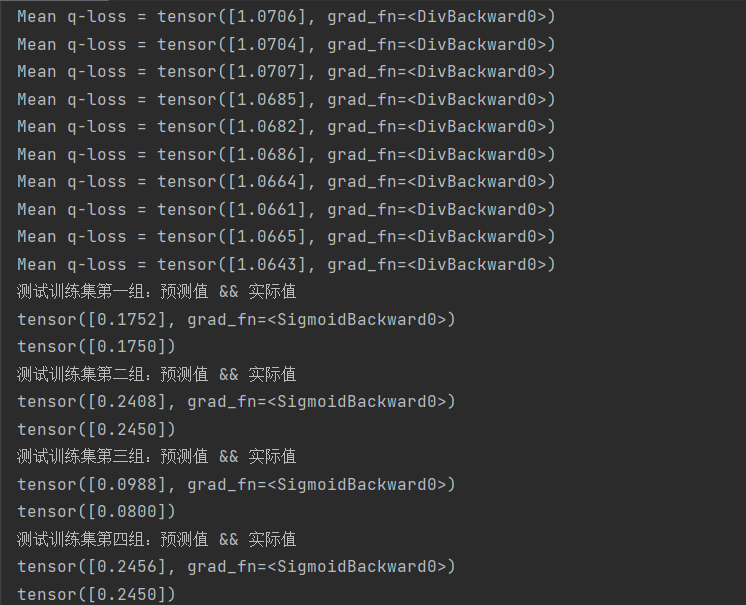

# MSCNN
## MSCNN算法1.1 实现流程
### （1）MSCNN算法框架图
 

### （2）实际完成情况说明
#### 1)SQL语句采用one——hot独热编码方式实现特征化查询转换
    对于SQL语句所涉及查询表的数量，采用长度为|T|的向量进行表示，其中位置上为1处即表示对应表为有效，构成向量Tq;
    对于SQL语句中所涉及的连接内心，采用长度为|W|的向量进行表示，其中位置上为1处即表示该条SQL查询语句使用对应的连接，构成向量Jq;
    对于SQL语句Where子句中的查询条件，采用（col, op, vars）进行表示，构成向量Cq。
   **此处采用one-hot独热编码进行SQL语句查询转化存在弊端** 
    1)、对于所生成的训练数据集D=([Tq, Jq, Cq])，其在进行torch.tensor()数据类型转换并torch.nn.functional.Normalization()进行归一化后，各族训练数据集数据差异小，且有效位数较少导致在输入数据经神经网络训练后，其输出值往往都是相同的，从而使得最终仅能满足其中一条查询语句的预测； 
    2）、针对上述情形，因此在测试所搭建的卷积神经网络时，其输入数据采用torch.randn()随机生成训练一组训练数据集：
         D1=([Tq1, Jq1, Cq1])，D2=([Tq2, Jq2, Cq2])，D3=([Tq3, Jq3, Cq3])，D4=([Tq4, Jq4, Cq4]) => D=(D1, D2, D3, D4)

#### 2）算法1.1实现代码
MSCNN.py

#### 3）测试结果图

实验结果分析： 
   可见在learning-rate=0.001,当所输入查询语句较多时，应当分批处理即确定batch大小，此处设batch=1。对于输入训练数据集其中输入Tq的维度为(10, 50)；输入Jq的维度为(7,50)；输入Cq的维度为(30,50)；将三类神经网络的输出结果经加权平均后按行进行拼接，作为预测模块神经网络的输入，因此维度为(1,150)，输出结果即为该batch中各SQL查询语句的基数估计值。
   
#### 4）创新思路
因为对于SQL语句查询话转化后在采用独热编码无法确定最终的矢量长度，且对于涉及多表和涉及单表不同情况的SQL查询语句时，其最终的矢量作为输入往往存在较多无效位且输出值往往相同，因此不妨采用注意力机制，提取属性特征中有效部分，实现高效且较准确的进行计算。
